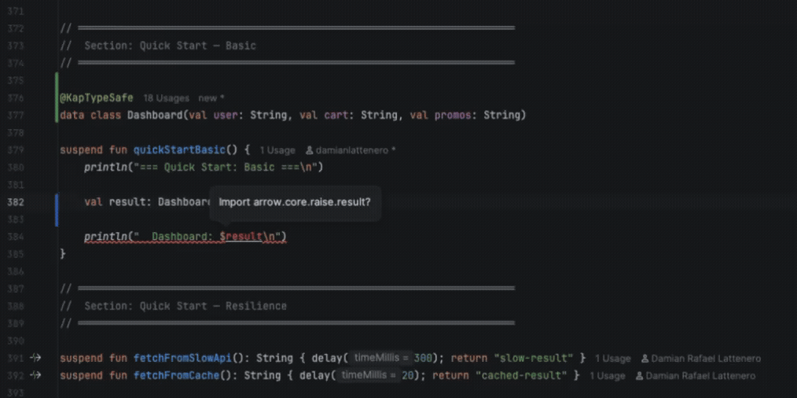

<p align="center">
  
</p>

<h1 align="center">KAP</h1>

<p align="center">
  <strong>Type-safe coroutine orchestration for Kotlin Multiplatform.</strong><br>
  The code reads like a diagram. The compiler won't let you wire it wrong.
</p>

<p align="center">
  <a href="https://github.com/damian-rafael-lattenero/kap/stargazers"></a>
  <a href="https://github.com/damian-rafael-lattenero/kap/actions/workflows/ci.yml"></a>
  <a href="https://central.sonatype.com/artifact/io.github.damian-rafael-lattenero/kap-core"></a>
  <a href="https://kotlinlang.org"></a>
  <a href="https://www.apache.org/licenses/LICENSE-2.0"></a>
</p>

<p align="center">
  <a href="https://damian-rafael-lattenero.github.io/kap/guide/quickstart/"><strong>Get Started</strong></a> · <a href="https://damian-rafael-lattenero.github.io/kap/"><strong>Docs</strong></a> · <a href="https://damian-rafael-lattenero.github.io/kap/playground/"><strong>Cookbook</strong></a>
</p>

---

## The problem

A checkout that calls 7 services in 4 phases. Stock validation needs retry. Payment needs a circuit breaker. Promos have a timeout. Read this and tell me: where are the phases? Where's the retry logic vs the business logic?

```kotlin
data class CheckoutResult(
    val user: String, val cart: String, val promos: String,
    val stock: Boolean,
    val shipping: Double, val tax: Double,
    val payment: String,
)

val breaker = CircuitBreaker(maxFailures = 5, resetTimeout = 30.seconds)

coroutineScope {
    val dUser  = async { fetchUser() }
    val dCart  = async { fetchCart() }
    val dPromos = async {
        withTimeout(3.seconds) { fetchPromos() }
    }
    val user   = dUser.await()
    val cart    = dCart.await()
    val promos  = dPromos.await()

    // --- phase 2: validate stock (with retry) ---
    var stock = false
    var attempt = 0
    var delay = 100.milliseconds
    while (true) {
        try {
            stock = validateStock()
            break
        } catch (e: CancellationException) { throw e }
        catch (e: Exception) {
            if (++attempt >= 3) throw e
            delay(delay)
            delay *= 2
        }
    }

    // --- phase 3: shipping & tax in parallel ---
    val dShipping = async { calcShipping() }
    val dTax      = async { calcTax() }
    val shipping  = dShipping.await()
    val tax       = dTax.await()

    // --- phase 4: payment (with circuit breaker) ---
    val payment = if (!breaker.shouldAttempt()) {
        throw CircuitBreakerOpenException()
    } else {
        try {
            val p = withTimeout(5.seconds) { reservePayment() }
            breaker.recordSuccess()
            p
        } catch (e: CancellationException) { throw e }
        catch (e: Exception) {
            breaker.recordFailure()
            throw e
        }
    }

    CheckoutResult(user, cart, promos, stock, shipping, tax, payment)
}
```

The phases are buried. The retry loop broke the async/await rhythm. The circuit breaker is interleaved with the business flow. Add one more concern and it gets worse.

## With KAP

```kotlin
@KapTypeSafe
data class CheckoutResult(
    val user: String, val cart: String, val promos: String,
    val stock: Boolean,
    val shipping: Double, val tax: Double,
    val payment: String,
)

val retryPolicy = Schedule.exponential<Throwable>(100.milliseconds) and Schedule.times(3)
val breaker = CircuitBreaker(maxFailures = 5, resetTimeout = 30.seconds)

kap(::CheckoutResult)
    .withUser { fetchUser() }                                         // ┐
    .withCart { fetchCart() }                                          // ├─ phase 1: parallel
    .withPromos(Kap { fetchPromos() }.timeout(3.seconds))               // ┘  + timeout on promos
    .thenStock(Kap { validateStock() }.retry(retryPolicy))            // ── phase 2: barrier + retry
    .withShipping { calcShipping() }                                  // ┐ phase 3: parallel
    .withTax { calcTax() }                                            // ┘
    .thenPayment(Kap { reservePayment() }                             // ── phase 4: barrier
        .withCircuitBreaker(breaker)                                  //    + circuit breaker
        .timeout(5.seconds))()                                          //    + timeout
```

Same 7 calls, same 4 phases, same retry, same circuit breaker, same timeouts. `.with` = parallel, `.then` = barrier. Resilience is per-call, inline, composable.

`@KapTypeSafe` generates a **step class per field** — after `.withUser`, the IDE only offers `.withCart`. You can't swap, skip, or forget a field:

<p align="center">
  
</p>

---

## Three concepts. That's it.

| You write | What happens | Think of it as |
|---|---|---|
| `.withX { }` | Runs in parallel with everything else in the same phase | "and at the same time..." |
| `.thenX { }` | Waits for all above, then continues | "once that's done..." |
| `.andThen { result -> }` | Waits, passes the result, builds the next graph | "using what we got..." |

---

## Start simple

Most use cases don't need retry or circuit breakers. At its core, KAP is just a clean way to run things in parallel and combine the results:

```kotlin
@KapTypeSafe
data class Dashboard(val user: String, val feed: String, val notifications: Int)

kap(::Dashboard)
    .withUser { fetchUser() }                // ┐
    .withFeed { fetchFeed() }                // ├─ all three run in parallel
    .withNotifications { countUnread() }()     // ┘
```

Need one field to wait for another? Change `.with` to `.then`:

```kotlin
@KapTypeSafe
data class ProfilePage(val user: String, val avatar: String, val recommendations: String)

kap(::ProfilePage)
    .withUser { fetchUser(id) }                              // ┐ parallel
    .withAvatar { fetchAvatar(id) }                          // ┘
    .thenRecommendations { fetchRecommendations(user) }()      // waits for user, then fetches
```

Need the result of one graph to decide what to build next? Use `.andThen`:

```kotlin
kap(::Dashboard)
    .withUser { fetchUser() }
    .withFeed { fetchFeed() }
    .withNotifications { countUnread() }
    .andThen { dashboard ->
        // use dashboard.user to decide what's next
        kap(::FullPage)
            .withDashboard { dashboard }
            .withSuggestions { fetchSuggestions(dashboard.user) }
    }()
```

Nothing runs until `()`. The graph is data — you can build it dynamically, pass it around, compose it.

---

## It scales

11 microservice calls. 5 phases. 8 Strings, 2 Booleans, 3 Doubles — the compiler catches every swap:

```kotlin
@KapTypeSafe
data class CheckoutResult(
    val user: String, val cart: String,
    val promos: String, val inventory: Boolean,
    val stock: Boolean,
    val shipping: Double, val tax: Double, val discounts: Double,
    val payment: String,
    val confirmation: String, val email: String,
)

kap(::CheckoutResult)
    .withUser { fetchUser() }                      // ┐
    .withCart { fetchCart() }                       // ├─ phase 1: parallel
    .withPromos { fetchPromos() }                  // │
    .withInventory { fetchInventory() }            // ┘
    .thenStock { validateStock() }                 // ── phase 2: barrier
    .withShipping { calcShipping() }               // ┐
    .withTax { calcTax() }                         // ├─ phase 3: parallel
    .withDiscounts { calcDiscounts() }             // ┘
    .thenPayment { reservePayment() }              // ── phase 4: barrier
    .withConfirmation { generateConfirmation() }   // ┐ phase 5
    .withEmail { sendEmail() }()                     // ┘
```

<details>
<summary><b>Same thing with raw coroutines (30 lines)</b></summary>

```kotlin
val checkout = coroutineScope {
    val dUser = async { fetchUser() }
    val dCart = async { fetchCart() }
    val dPromos = async { fetchPromos() }
    val dInventory = async { fetchInventory() }
    val user = dUser.await()
    val cart = dCart.await()
    val promos = dPromos.await()
    val inventory = dInventory.await()

    val stock = validateStock()

    val dShipping = async { calcShipping() }
    val dTax = async { calcTax() }
    val dDiscounts = async { calcDiscounts() }
    val shipping = dShipping.await()
    val tax = dTax.await()
    val discounts = dDiscounts.await()

    val payment = reservePayment()

    val dConfirmation = async { generateConfirmation() }
    val dEmail = async { sendEmail() }

    CheckoutResult(
        user, cart, promos, inventory, stock,
        shipping, tax, discounts, payment,
        dConfirmation.await(), dEmail.await()
    )
}
```

</details>

---

## "What if one call fails?"

By default, if any `.with` branch fails, the whole graph is cancelled — structured concurrency. But sometimes you want partial failures. `settled { }` wraps the result in `Result<A>` so a failure doesn't kill the rest:

```kotlin
@KapTypeSafe
data class HomePage(val profile: String, val feed: Result<String>, val ads: Result<String>)

kap(::HomePage)
    .withProfile { fetchProfile() }              // critical — failure cancels everything
    .withFeed(settled { fetchFeed() })           // optional — failure returns Result.failure
    .withAds(settled { fetchAds() })()             // optional — failure returns Result.failure
// Feed throws? Profile and ads still complete. You get Result.failure for feed.
```

Need ALL results even if some fail? `sequenceSettled` runs every item and collects outcomes:

```kotlin
val results = listOf("svc-a", "svc-b", "svc-c").traverseSettled { svc ->
    Kap { callService(svc) }
}()
// → [Success("ok"), Failure(TimeoutException), Success("ok")]
```

## More superpowers

Each one is a method call. No boilerplate, no manual state.

**Race** — fastest wins, losers cancelled:

```kotlin
val price = raceN(
    Kap { pricingFromUS(item) },
    Kap { pricingFromEU(item) },
    Kap { pricingFromAsia(item) },
)()  // fastest response wins, other two cancelled
```

**Bounded concurrency** — process N items, max M at a time:

```kotlin
val users = userIds.traverse(concurrency = 5) { id ->
    Kap { fetchUser(id) }
}()  // 100 users, 5 at a time, results in order
```

**Timeout with parallel fallback** — don't wait, race against the cache:

```kotlin
val data = Kap { fetchFromApi() }
    .timeoutRace(2.seconds, fallback = Kap { readFromCache() })()  // both start at t=0, API wins if fast enough, cache if not
```

**Composable retry** — define once, reuse everywhere:

```kotlin
val policy = Schedule.exponential<Throwable>(100.milliseconds)
    .jittered()                          // ±50% random spread (no thundering herd)
    .and(Schedule.times(3))              // max 3 attempts
    .withMaxDuration(10.seconds)         // total budget

Kap { callFlakyService() }.retry(policy)()
```

**Timed** — measure any call without manual instrumentation:

```kotlin
@KapTypeSafe
data class Dashboard(val user: String, val latency: TimedResult<String>)

kap(::Dashboard)
    .withUser { fetchUser() }
    .withLatency(timed { fetchSlowService() })()   // TimedResult(value, duration)
// dashboard.latency.duration → 230.ms
```

**Memoize** — compute once, cache thread-safely:

```kotlin
val config = Kap { loadRemoteConfig() }.memoizeOnSuccess()

// call it from 10 coroutines — only one HTTP request, others wait for the cached result
// if it fails, next caller retries (failures are NOT cached)
```

**Real HTTP** — not just simulated delays. This hits the GitHub API:

```kotlin
@KapTypeSafe
data class DeveloperProfile(val user: GithubUser, val topRepos: List<GithubRepo>, val funFact: String)

val profile = kap(::DeveloperProfile)
    .withUser { client.get("https://api.github.com/users/kotlin").body() }
    .withTopRepos { client.get("https://api.github.com/users/kotlin/repos?sort=stars").body() }
    .withFunFact { client.get("https://catfact.ninja/fact").body<CatFact>().fact }
    .evalGraph()
// 3 HTTP calls in parallel, one result. See examples/real-world-http for the full example.
```

---

## The full picture

Everything together in a real order placement: validate input (accumulate ALL errors), race pricing providers, reserve inventory with retry, charge payment through a circuit breaker, send notifications where partial failure is OK — all inside a database transaction with guaranteed cleanup.

```kotlin
@KapTypeSafe
data class OrderResult(
    val finalPrice: Double,
    val reservationId: String,
    val paymentId: String,
    val notifications: List<Result<Unit>>,
)

val retryPolicy = Schedule.exponential<Throwable>(100.milliseconds).jittered() and Schedule.times(3)
val paymentBreaker = CircuitBreaker(maxFailures = 5, resetTimeout = 30.seconds)

suspend fun placeOrder(input: OrderInput): Either<Nel<OrderError>, OrderResult> {

    // ── Phase 1: validate (parallel, accumulate ALL errors) ──────────
    val validated = kapV<OrderError, ValidAddress, ValidCard, ValidItems, ValidOrder>(::ValidOrder)
        .withV { validateAddress(input.address) }       // ┐ all three run in parallel
        .withV { validatePaymentInfo(input.card) }      // ├─ errors accumulate
        .withV { validateItems(input.items) }()           // ┘

    val order = validated.getOrElse { return Either.Left(it) }

    // ── Phases 2–5: process inside DB transaction ────────────────────
    return bracketCase(
        acquire = { db.beginTransaction() },
        use = { tx ->
            kap(::OrderResult)
                .withFinalPrice(raceN(                              // phase 2: race 3 providers
                    Kap { pricingServiceA(order) },                 //   fastest wins, losers cancelled
                    Kap { pricingServiceB(order) },
                    Kap { pricingServiceC(order) },
                ))
                .thenReservationId(                                 // phase 3: barrier + retry
                    Kap { reserveInventory(tx, order) }
                        .retry(retryPolicy)
                )
                .thenPaymentId(                                     // phase 4: barrier + circuit breaker
                    Kap { chargePayment(tx, order) }
                        .withCircuitBreaker(paymentBreaker)
                        .timeout(5.seconds)
                )
                .withNotifications(listOf(                          // phase 5: parallel, partial failure OK
                    Kap { sendEmail(order) },                       //   settled → Result per call
                    Kap { sendPush(order) },
                    Kap { updateAnalytics(order) },
                ).sequenceSettled())
                .map { Either.Right(it) }
        },
        release = { tx, exit -> when (exit) {                       // guaranteed cleanup
            is ExitCase.Completed -> tx.commit()
            else                  -> tx.rollback()
        }}
    )()
}
```

<details>
<summary><b>Same thing with raw coroutines (~90 lines)</b></summary>

```kotlin
val paymentBreaker = CircuitBreaker(maxFailures = 5, resetTimeout = 30.seconds)

suspend fun placeOrder(input: OrderInput): Either<Nel<OrderError>, OrderResult> {

    // ── Phase 1: validate (need supervisorScope to not short-circuit) ──
    val (addr, card, items) = supervisorScope {
        val dAddr  = async { validateAddress(input.address) }
        val dCard  = async { validatePaymentInfo(input.card) }
        val dItems = async { validateItems(input.items) }
        Triple(dAddr.await(), dCard.await(), dItems.await())
    }

    val errors = buildList {
        addr.leftOrNull()?.let(::addAll)
        card.leftOrNull()?.let(::addAll)
        items.leftOrNull()?.let(::addAll)
    }
    if (errors.isNotEmpty()) return Either.Left(NonEmptyList.fromListUnsafe(errors))

    val validAddress = addr.getOrNull()!!
    val validCard    = card.getOrNull()!!
    val validItems   = items.getOrNull()!!
    val order = ValidOrder(validAddress, validCard, validItems)

    // ── Phase 2: race 3 pricing providers (manual select) ──
    val bestPrice = coroutineScope {
        val jobs = listOf(
            async { pricingServiceA(order) },
            async { pricingServiceB(order) },
            async { pricingServiceC(order) },
        )
        select {
            jobs.forEach { d ->
                d.onAwait { price ->
                    jobs.forEach { it.cancel() }
                    price
                }
            }
        }
    }

    // ── Phases 3–5: inside DB transaction (manual try/finally) ──
    val tx = db.beginTransaction()
    try {
        // Phase 3: reserve inventory (manual retry + exponential backoff)
        var reservationId: String? = null
        var attempt = 0
        var retryDelay = 100.milliseconds
        while (reservationId == null) {
            try {
                reservationId = reserveInventory(tx, order)
            } catch (e: CancellationException) { throw e }
            catch (e: Exception) {
                if (++attempt >= 3) throw e
                delay(retryDelay)
                retryDelay = (retryDelay * 2).coerceAtMost(1600.milliseconds)
                // (no jitter — you'd need Random + math here too)
            }
        }

        // Phase 4: charge payment (manual circuit breaker + timeout)
        val paymentId = if (!paymentBreaker.shouldAttempt()) {
            throw CircuitBreakerOpenException()
        } else {
            try {
                val p = withTimeout(5.seconds) { chargePayment(tx, order) }
                paymentBreaker.recordSuccess()
                p
            } catch (e: CancellationException) { throw e }
            catch (e: Exception) {
                paymentBreaker.recordFailure()
                throw e
            }
        }

        // Phase 5: send notifications (need supervisorScope so one failure doesn't kill the rest)
        val notifications = supervisorScope {
            listOf(
                async { runCatching { sendEmail(order) } },
                async { runCatching { sendPush(order) } },
                async { runCatching { updateAnalytics(order) } },
            ).map { it.await() }
        }

        tx.commit()
        Either.Right(OrderResult(bestPrice, reservationId, paymentId, notifications))
    } catch (e: Exception) {
        tx.rollback()
        throw e
    }
}
```

</details>

---

## Pick what you need

| Module | What it gives you | When you need it |
|---|---|---|
| **kap-core** | `.with`, `.then`, `.andThen`, `race`, `traverse`, `memoize`, `settled` | Always |
| **kap-ksp** | `@KapTypeSafe`, `@KapBridge` — compile-time named builders with IDE autocomplete | When you want swap-proof, guided orchestration |
| **kap-resilience** | `retry`, `Schedule`, `CircuitBreaker`, `Resource`, `bracket`, `raceQuorum`, `timeoutRace` | When you call external services |
| **kap-arrow** | `.withV`, `kapV`, error accumulation with `Either<NonEmptyList<E>, A>` | When you need parallel validation |
| **kap-ktor** | `respondAsync`, `KapTracer`, circuit breaker plugin | When you use Ktor |
| **kap-kotest** | `shouldSucceedWith`, `shouldFailWith`, `shouldCompleteWithin` | When you test Kap graphs |

---

## KAP and Arrow

KAP is **not** a replacement for Arrow. They solve different problems and work together:

- **Arrow** gives you the types: `Either`, `NonEmptyList`, `Option`, functional error handling
- **KAP** gives you the orchestration: parallel phases, resilience, structured execution graphs

KAP's `kap-arrow` module builds on Arrow's `Either` and `NonEmptyList` for parallel validation with error accumulation. Use both — Arrow for your domain types, KAP for wiring them together:

```kotlin
// Arrow types + KAP orchestration
val result: Either<Nel<OrderError>, OrderResult> =
    kapV<OrderError, ValidEmail, ValidAge, User>(::User)
        .withV { validateEmail(input) }    // returns Either<Nel<OrderError>, ValidEmail>
        .withV { validateAge(input) }()      // returns Either<Nel<OrderError>, ValidAge>
// Both run in parallel. Both errors collected. Arrow types, KAP execution.
```

| | Arrow | KAP | Together |
|---|---|---|---|
| **Parallel execution** | `parZip` (max 9 args) | `.with` / `kap(::T)` (unlimited) | KAP orchestrates, Arrow types flow through |
| **Error accumulation** | `zipOrAccumulate` | `kapV` + `.withV` (max 22 args) | KAP runs validators in parallel, Arrow collects errors |
| **Retry / Circuit breaker** | `Schedule` (Arrow) | `Schedule` + `CircuitBreaker` (KAP) | KAP's compose inline with `.with` / `.then` chains |
| **Phase barriers** | Manual nesting | `.then` / `.andThen` | Only KAP has first-class phases |

---

## Works with your stack

KAP is just suspend functions in, result out. It works anywhere coroutines work:

```kotlin
// Ktor
get("/checkout/{id}") {
    val id = call.parameters["id"]!!
    val result = kap(::CheckoutResult)
        .withUser { userService.fetch(id) }
        .withCart { cartService.fetch(id) }
        .withPromos { promoService.fetch(id) }()                  // () is shorthand for ()
    call.respond(result)
}

// Spring Boot
@RestController
class CheckoutController(val userService: UserService, val cartService: CartService) {

    @GetMapping("/checkout/{id}")
    suspend fun checkout(@PathVariable id: String): CheckoutResult =
        kap(::CheckoutResult)
            .withUser { userService.fetch(id) }
            .withCart { cartService.fetch(id) }
            .withPromos { promoService.fetch(id) }()
}

// Android ViewModel
class HomeViewModel : ViewModel() {
    val state = MutableStateFlow<HomeState>(Loading)

    fun load() = viewModelScope.launch {
        val home = kap(::HomeData)
            .withProfile { repo.fetchProfile() }
            .withFeed(settled { repo.fetchFeed() })
            .withNotifications { repo.countUnread() }()
        state.value = Ready(home)
    }
}
```

No framework, no runtime, no annotation processing at runtime. Your suspend functions go in, your data class comes out.

---

## Install

```kotlin
plugins {
    id("com.google.devtools.ksp") // only needed for @KapTypeSafe
}

dependencies {
    implementation("io.github.damian-rafael-lattenero:kap-core:2.7.0")

    // optional — add any combination
    implementation("io.github.damian-rafael-lattenero:kap-resilience:2.7.0")
    implementation("io.github.damian-rafael-lattenero:kap-arrow:2.7.0")
    implementation("io.github.damian-rafael-lattenero:kap-ksp-annotations:2.7.0")
    ksp("io.github.damian-rafael-lattenero:kap-ksp:2.7.0")
}
```

> **[Starter project](https://github.com/damian-rafael-lattenero/kap-starter)** — clone and run in 30 seconds.

---

## When to use KAP

**Use it when:**
- You orchestrate 3+ async calls that feed into one result
- You have multi-phase pipelines (fetch, validate, process, confirm)
- You need resilience patterns that compose without nesting
- You want parallel validation that collects all errors

**Skip it when:**
- You have 1-2 independent async calls — `coroutineScope { async {} }` is fine
- You don't need structured phases or resilience composition
- You're building streams/flows, not request-scoped graphs

---

## Benchmarks

| Dimension | Raw Coroutines | KAP |
|---|---|---|
| Framework overhead (arity 3) | <0.01ms | <0.01ms |
| Multi-phase (9 calls, 4 phases) | 180.85ms | 180.98ms |
| 5 parallel calls @ 50ms each | 50.27ms | 50.31ms |

KAP adds **zero measurable overhead**. The abstraction compiles away. [Full benchmark suite (119 JMH benchmarks)](https://damian-rafael-lattenero.github.io/kap/benchmarks/).

---

900+ tests · [Maven Central](https://central.sonatype.com/artifact/io.github.damian-rafael-lattenero/kap-core) · Kotlin Multiplatform (JVM, JS, WASM, Native) · Apache 2.0

<p align="center">
  <a href="https://damian-rafael-lattenero.github.io/kap/guide/quickstart/"><strong>Get Started</strong></a> · <a href="https://damian-rafael-lattenero.github.io/kap/"><strong>Docs</strong></a> · <a href="https://damian-rafael-lattenero.github.io/kap/playground/"><strong>Cookbook</strong></a>
</p>
