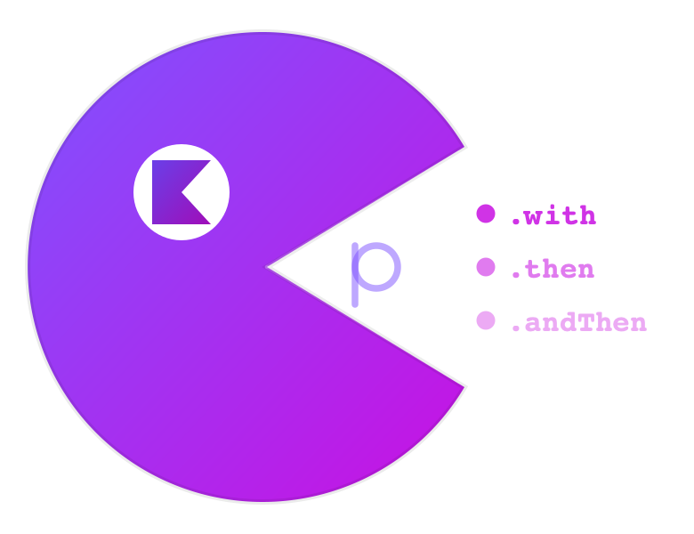

---
hide:
  - navigation
  - toc
---

<style>
.md-content__inner { max-width: 960px; margin: 0 auto; }
.hero { text-align: center; padding: 2rem 0 1rem; }
.hero img { width: 160px; }
.hero h1 { font-size: 2.4rem; margin-top: 1rem; }
.hero p { font-size: 1.15rem; color: var(--md-default-fg-color--light); }
</style>

<div class="hero">
  
  <h1>KAP</h1>
  <p><strong>Type-safe coroutine orchestration for Kotlin Multiplatform.</strong><br>
  The code reads like a diagram. The compiler won't let you wire it wrong.</p>
  <p>
    <a href="guide/quickstart/" class="md-button md-button--primary">Get Started</a>
    <a href="https://github.com/damian-rafael-lattenero/kap" class="md-button">GitHub</a>
  </p>
</div>

---

## 11 services. 5 phases. One flat chain.

You have a checkout flow: fetch user, cart, promos, inventory in parallel. Wait. Validate stock. Wait. Calculate shipping, tax, discounts in parallel. Wait. Reserve payment. Wait. Generate confirmation and send email in parallel.

With raw coroutines, this is **30+ lines of shuttle variables, invisible phases, and silent bugs**:

```kotlin
// Raw coroutines: 30+ lines, invisible phases, silent bugs
val checkout = coroutineScope {
    val dUser = async { fetchUser() }
    val dCart = async { fetchCart() }
    val dPromos = async { fetchPromos() }
    val dInventory = async { fetchInventory() }
    val user = dUser.await()          // ← move above async? Silent serialization.
    val cart = dCart.await()           // ← swap with promos? Same type = no compiler error.
    val promos = dPromos.await()
    val inventory = dInventory.await()

    val stock = validateStock()       // Where does phase 1 end? You have to read every line.

    val dShipping = async { calcShipping() }
    val dTax = async { calcTax() }
    val dDiscounts = async { calcDiscounts() }
    val shipping = dShipping.await()
    val tax = dTax.await()
    val discounts = dDiscounts.await()

    val payment = reservePayment()    // Another invisible barrier.

    val dConfirmation = async { generateConfirmation() }
    val dEmail = async { sendEmail() }

    CheckoutResult(
        user, cart, promos, inventory, stock,
        shipping, tax, discounts, payment,
        dConfirmation.await(), dEmail.await()
    )
}
```

**With KAP + `@KapTypeSafe`:**

```kotlin
@KapTypeSafe
data class CheckoutResult(
    val user: User, val cart: Cart, val promos: Promos, val inventory: Inventory,
    val stock: StockCheck, val shipping: Shipping, val tax: Tax, val discounts: Discounts,
    val payment: Payment, val confirmation: Confirmation, val email: Email,
)

// @KapTypeSafe generates named builders: .withUser {}, .withCart {}, .thenStock {}, etc.
val checkout: CheckoutResult = kap(::CheckoutResult)
    .withUser { fetchUser() }              // ┐
    .withCart { fetchCart() }               // ├─ phase 1: parallel
    .withPromos { fetchPromos() }           // │
    .withInventory { fetchInventory() }     // ┘
    .thenStock { validateStock() }          // ── phase 2: barrier
    .withShipping { calcShipping() }        // ┐
    .withTax { calcTax() }                  // ├─ phase 3: parallel
    .withDiscounts { calcDiscounts() }      // ┘
    .thenPayment { reservePayment() }       // ── phase 4: barrier
    .withConfirmation { generateConfirmation() }  // ┐ phase 5: parallel
    .withEmail { sendEmail() }             // ┘
    .executeGraph()
```

**30 lines vs 14.** Invisible phases vs explicit phases. Silent bugs vs compile-time safety. **Named builders make each step self-documenting** — and the typed function chain still locks parameter order at compile time.

!!! tip "`@KapTypeSafe` named builders"
    The `@KapTypeSafe` annotation (via KSP) generates `.withParamName {}` and `.thenParamName {}` extension methods from your data class properties. This is the **recommended user-facing pattern**. The generic `.with {}` / `.then {}` API still works and is used internally, but named builders make your orchestration chains more readable and harder to misuse.

```
t=0ms   ─── fetchUser ────────┐
t=0ms   ─── fetchCart ────────┤
t=0ms   ─── fetchPromos ─────├─ phase 1 (parallel)
t=0ms   ─── fetchInventory ──┘
t=50ms  ─── validateStock ───── phase 2 (barrier)
t=60ms  ─── calcShipping ────┐
t=60ms  ─── calcTax ─────────├─ phase 3 (parallel)
t=60ms  ─── calcDiscounts ───┘
t=80ms  ─── reservePayment ──── phase 4 (barrier)
t=90ms  ─── generateConfirm ─┐
t=90ms  ─── sendEmail ───────┘─ phase 5 (parallel)
t=130ms ─── done
```

**130ms total** (vs 460ms sequential). Verified in [`ConcurrencyProofTest.kt`](https://github.com/damian-rafael-lattenero/kap/blob/master/kap-core/src/jvmTest/kotlin/kap/ConcurrencyProofTest.kt).

---

## Value-dependent phases

Real APIs have dependencies: phase 2 needs phase 1's results. With raw coroutines, you thread values through variables manually. With KAP, the dependency graph **is** the code shape:

```kotlin
@KapTypeSafe
data class UserContext(val profile: Profile, val preferences: Prefs, val loyaltyTier: Tier)
@KapTypeSafe
data class EnrichedContent(val recommendations: Recs, val promotions: Promos, val trending: Trending, val history: History)
@KapTypeSafe
data class FinalDashboard(val layout: Layout, val analytics: Analytics)

val userId = "user-42"

val dashboard: FinalDashboard = kap(::UserContext)
    .withProfile { fetchProfile(userId) }       // ┐
    .withPreferences { fetchPreferences(userId) }   // ├─ phase 1: parallel
    .withLoyaltyTier { fetchLoyaltyTier(userId) }   // ┘
    .andThen { ctx ->                    // ── barrier: ctx available
        kap(::EnrichedContent)
            .withRecommendations { fetchRecommendations(ctx.profile) }  // ┐
            .withPromotions { fetchPromotions(ctx.tier) }               // ├─ phase 2: parallel
            .withTrending { fetchTrending(ctx.prefs) }                  // │
            .withHistory { fetchHistory(ctx.profile) }                  // ┘
            .andThen { enriched ->                         // ── barrier
                kap(::FinalDashboard)
                    .withLayout { renderLayout(ctx, enriched) }     // ┐ phase 3
                    .withAnalytics { trackAnalytics(ctx, enriched) }   // ┘
            }
    }
    .executeGraph()
```

```
t=0ms   ─── fetchProfile ──────┐
t=0ms   ─── fetchPreferences ──├─ phase 1 (parallel)
t=0ms   ─── fetchLoyaltyTier ──┘
t=50ms  ─── andThen { ctx -> }  ── barrier, ctx available
t=50ms  ─── fetchRecommendations ──┐
t=50ms  ─── fetchPromotions ───────├─ phase 2 (parallel)
t=50ms  ─── fetchTrending ─────────┤
t=50ms  ─── fetchHistory ──────────┘
t=90ms  ─── andThen { enriched -> } ── barrier
t=90ms  ─── renderLayout ──┐
t=90ms  ─── trackAnalytics ┘─ phase 3 (parallel)
t=115ms ─── FinalDashboard ready
```

14 service calls, 3 phases, **115ms vs 460ms sequential**.

---

## Add resilience in the same chain

```kotlin
@KapTypeSafe
data class Dashboard(val user: String, val slowData: String, val promos: String)

val breaker = CircuitBreaker(maxFailures = 5, resetTimeout = 30.seconds)
val retryPolicy = Schedule.times<Throwable>(3) and Schedule.exponential(10.milliseconds)

val result = kap(::Dashboard)
    .withUser(Kap { fetchUser() }
        .withCircuitBreaker(breaker)      // protect downstream
        .retry(retryPolicy))              // exponential backoff
    .withSlowData(Kap { fetchFromSlowApi() }
        .timeoutRace(100.milliseconds,    // both start at t=0
            Kap { fetchFromCache() }))    // fallback already running
    .withPromos { fetchPromos() }
    .executeGraph()
```

---

## Collect every validation error at once

```kotlin
val result: Either<NonEmptyList<RegError>, User> = zipV(
    { validateName("A") },           // ← too short
    { validateEmail("bad") },         // ← invalid
    { validateAge(10) },              // ← too young
    { checkUsername("al") },          // ← too short
) { name, email, age, username -> User(name, email, age, username) }
    .executeGraph()
// result = Left(NonEmptyList(NameTooShort, InvalidEmail, AgeTooLow, UsernameTaken))
// ALL 4 errors in ONE response. No round trips.
```

Scales to **22 validators** (Arrow's `zipOrAccumulate` maxes at 9).

---

## Full API at a glance

### [kap-core](modules/kap-core.md) — Foundation

**Orchestration**

- [`.with`](modules/kap-core.md#with-independent-tasks-in-parallel) / [`.then`](modules/kap-core.md#then-phase-barrier) / [`.andThen`](modules/kap-core.md#andthen-dependent-phase) — parallel, barrier, dependent phase
- [`kap(f)`](modules/kap-core.md#kapf-curry-a-function-for-with-chains) — curry any function for type-safe `.with` chains
- [`computation { }`](modules/kap-core.md#computation-imperative-builder) — imperative builder with `bind`

**Error handling**

- [`.timeout`](modules/kap-core.md#timeoutduration-default) — deadline with default value or fallback computation
- [`.recover` / `.recoverWith`](modules/kap-core.md#recover-recoverwith) — catch and transform errors
- [`.retry`](modules/kap-core.md#retrymaxattempts-delay-backoff) — retry with backoff strategy
- [`.ensure` / `.ensureNotNull`](modules/kap-core.md#ensureerror-predicate-ensurenotnullerror-extract) — predicate guards
- [`catching`](modules/kap-core.md#catching-exception-safe-result) — wrap exceptions into `Result`

**Collections**

- [`traverse`](modules/kap-core.md#traverse) / [`traverseSettled`](modules/kap-core.md#traversesettled-collect-all-results-no-cancellation) / [`traverseDiscard`](modules/kap-core.md#traversediscard-fire-and-forget) — parallel map over collections
- [`sequence`](modules/kap-core.md#sequence-sequenceconcurrency) — execute all, with optional concurrency limit
- [`settled`](modules/kap-core.md#partial-failure) — collect successes and failures without cancellation

**Racing**

- [`raceN`](modules/kap-core.md#racenc1-c2-cn-first-to-succeed-wins-rest-cancelled) — first to succeed wins, rest cancelled
- [`race`](modules/kap-core.md#racefa-fb-two-way-race) / [`raceAll`](modules/kap-core.md#racealllist-race-a-dynamic-list) — two-way and dynamic-list races
- [`.orElse` / `firstSuccessOf`](modules/kap-core.md#orelseother-firstsuccessof) — sequential fallback chains

**Flow integration**

- [`mapKap` / `mapKapOrdered`](modules/kap-core.md#flow-integration) — parallel transforms inside Flows
- [`mapEffectOrdered`](modules/kap-core.md#flowmapeffectordered-preserve-upstream-order) — ordered async transformation preserving emission order
- [`firstAsKap` / `collectAsKap`](modules/kap-core.md#flowfirstaskap) — bridge Flow to Kap

**Utilities**

- [`memoize` / `memoizeOnSuccess`](modules/kap-core.md#memoization) — cache computation results thread-safely
- [`timed { }`](modules/kap-core.md#timed--measure-any-call-without-manual-instrumentation) — measure wall-clock duration of any call
- [`Kap.of` / `.empty` / `.failed` / `.defer`](modules/kap-core.md#kapofvalue-kapempty-kapfailederror-kapdefer) — construction helpers
- [`Deferred.toKap()` / `.toDeferred`](modules/kap-core.md#interop) — coroutine interop
- [`traced` / `KapTracer`](modules/kap-core.md#observability) — structured observability hooks
- [`combine` / `pair` / `triple` / `zip`](modules/kap-core.md#utilities) — parallel combinators
- [`named` / `on` / `discard` / `peek`](modules/kap-core.md#oncontext-namedname) — chain modifiers
- [`delayed` / `.executeGraph`](modules/kap-core.md#delayedduration-value-withornull) — execution control

---

### [kap-resilience](modules/kap-resilience.md) — Fault Tolerance

- [`Schedule`](modules/kap-resilience.md#schedule-composable-retry-policies) — composable retry policies (`times`, `exponential`, `fibonacci`, `linear`, `forever`)
- [`.jittered`](modules/kap-resilience.md#jittered-prevent-thundering-herd) / [`.withMaxDuration`](modules/kap-resilience.md#withmaxdurationd-total-time-cap) — schedule modifiers
- [`.and` / `.or` / `.fold`](modules/kap-resilience.md#composition) — schedule composition
- [`retryOrElse`](modules/kap-resilience.md#retryorelseschedule-fallback-fallback-after-exhaustion) / [`retryWithResult`](modules/kap-resilience.md#retrywithresultschedule-returns-full-context) — retry with fallback or full context
- [`CircuitBreaker`](modules/kap-resilience.md#circuitbreaker) — fail fast when a dependency is down
- [`timeoutRace`](modules/kap-resilience.md#timeoutrace-parallel-fallback) — race primary against eager fallback
- [`raceQuorum`](modules/kap-resilience.md#racequorum-n-of-m-successes) — N-of-M quorum pattern
- [`bracket`](modules/kap-resilience.md#bracket-guaranteed-cleanup) / [`bracketCase`](modules/kap-resilience.md#bracketcase-release-depends-on-outcome) — guaranteed cleanup
- [`Resource`](modules/kap-resilience.md#resource-composable-resource) — composable acquire / use / release
- [`guarantee` / `guaranteeCase`](modules/kap-resilience.md#guarantee-guaranteecase) — unconditional finalizers

---

### [kap-arrow](modules/kap-arrow.md) — Parallel Validation

- [`zipV`](modules/kap-arrow.md#zipv-parallel-validation-2-22-args) — parallel validation with error accumulation (2–22 args)
- [`kapV` + `withV`](modules/kap-arrow.md#kapv-withv-curried-builder) — curried validation builder
- [`thenV` / `andThenV`](modules/kap-arrow.md#phased-validation-thenv-andthenv) — phased validation with short-circuit
- [`valid` / `invalid` / `invalidAll`](modules/kap-arrow.md#entry-points) — entry points
- [`catching(toError)`](modules/kap-arrow.md#catchingtoerror-exception-to-error-bridge) — exceptions to validation errors
- [`ensureV` / `ensureVAll`](modules/kap-arrow.md#guards-ensurev-ensurevall) — validation guards
- [`mapV` / `mapError` / `recoverV` / `orThrow`](modules/kap-arrow.md#transforms) — transforms
- [`traverseV` / `sequenceV`](modules/kap-arrow.md#collection-operations) — validate collections in parallel
- [`.attempt` / `raceEither`](modules/kap-arrow.md#arrow-interop) — Arrow Either interop
- [`accumulate { }`](modules/kap-arrow.md#accumulate-builder) — imperative builder with error accumulation

---

### [kap-ktor](modules/kap-ktor.md) — Ktor Integration

- [`install(Kap)`](modules/kap-ktor.md#plugin-installation) — one-line plugin setup
- [`ktorTracer` / `structuredTracer`](modules/kap-ktor.md#built-in-tracers) — SLF4J and JSON logging
- [Named circuit breakers](modules/kap-ktor.md#named-circuit-breakers) — per-dependency circuit breakers
- [`respondAsync` / `respondKap`](modules/kap-ktor.md#response-helpers) — response helpers
- [`kapExceptionHandlers`](modules/kap-ktor.md#statuspages-exception-handlers) — exception-to-HTTP status mapping

---

### [kap-kotest](modules/kap-kotest.md) — Testing

- [`shouldSucceed` / `shouldSucceedWith`](modules/kap-kotest.md#kap-matchers) — assert Kap success
- [`shouldFailWith` / `shouldFailWithMessage`](modules/kap-kotest.md#kap-matchers) — assert Kap failure
- [`shouldBeRight` / `shouldBeLeft`](modules/kap-kotest.md#arrow-matchers) — Arrow Either assertions
- [`shouldBeClosed` / `shouldBeOpen`](modules/kap-kotest.md#resilience-matchers) — circuit breaker state assertions
- [`shouldProveParallel` / `shouldBeMillis`](modules/kap-kotest.md#timing-matchers) — timing assertions

---

### [kap-ksp](modules/kap-ksp.md) — Code Generation

- [`@KapTypeSafe`](modules/kap-ksp.md#the-solution) — generate wrapper types to prevent same-type parameter swaps
- [Works on functions too](modules/kap-ksp.md#works-on-functions-too) — not just data classes
- [Prefix](modules/kap-ksp.md#prefix-avoiding-collisions) — avoid naming collisions across modules

---

## Modules

| Module | What you get | Depends on |
|---|---|---|
| [`kap-core`](modules/kap-core.md) | `with`, `then`, `andThen`, `race`, `traverse`, `memoize`, `settled`, `timeout`, `recover` | `kotlinx-coroutines-core` |
| [`kap-resilience`](modules/kap-resilience.md) | `Schedule`, `CircuitBreaker`, `Resource`, `bracket`, `timeoutRace`, `raceQuorum` | `kap-core` |
| [`kap-arrow`](modules/kap-arrow.md) | `zipV`, `withV`, `validated {}`, `attempt()`, `raceEither` | `kap-core` + Arrow |
| [`kap-ktor`](modules/kap-ktor.md) | Ktor plugin, circuit breaker registry, tracers, `respondAsync` | `kap-core` + Ktor |
| [`kap-kotest`](modules/kap-kotest.md) | `shouldSucceedWith`, `shouldFailWith`, timing & lifecycle matchers | `kap-core` (test) |

[API Reference (Dokka)](api/index.html){ .md-button }

```kotlin
plugins {
    id("com.google.devtools.ksp")  // Required for @KapTypeSafe
}

dependencies {
    implementation("io.github.damian-rafael-lattenero:kap-core:2.6.0")

    // KSP — named builder generation (@KapTypeSafe)
    implementation("io.github.damian-rafael-lattenero:kap-ksp-annotations:2.6.0")
    ksp("io.github.damian-rafael-lattenero:kap-ksp:2.6.0")

    // Optional
    implementation("io.github.damian-rafael-lattenero:kap-resilience:2.6.0")
    implementation("io.github.damian-rafael-lattenero:kap-arrow:2.6.0")
    implementation("io.github.damian-rafael-lattenero:kap-ktor:2.6.0")
    testImplementation("io.github.damian-rafael-lattenero:kap-kotest:2.6.0")
}
```

---

## Benchmarks

All claims backed by **119 JMH benchmarks** and deterministic virtual-time proofs.

| Dimension | Raw Coroutines | Arrow | KAP |
|---|---|---|---|
| **Framework overhead** (arity 3) | <0.01ms | 0.02ms | **<0.01ms** |
| **Framework overhead** (arity 9) | <0.01ms | 0.03ms | **<0.01ms** |
| **Simple parallel** (5 x 50ms) | 50.27ms | 50.33ms | **50.31ms** |
| **Multi-phase** (9 calls, 4 phases) | 180.85ms | 181.06ms | **180.98ms** |
| **Race** (50ms vs 100ms) | 100.34ms | 50.51ms | **50.40ms** |
| **timeoutRace** (primary wins) | 180.55ms | -- | **30.34ms** |
| **Max validation arity** | -- | 9 | **22** |

[Live benchmark dashboard](https://damian-rafael-lattenero.github.io/kap/benchmarks/){ .md-button }

